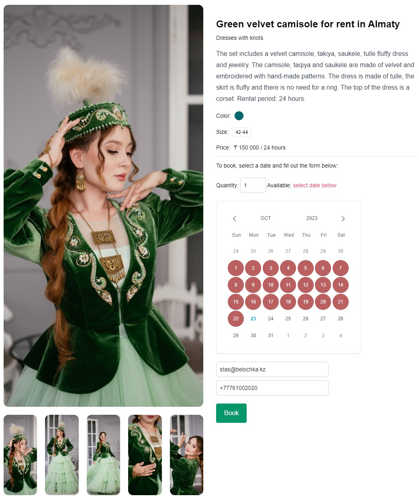

# Dress rent nuxt frontend

This is a multilanguage adaptive frontend repository in Nuxt3 with SSR for SEO, the - [backend is here](https://github.com/EvolutionInIT/dress_rent_backend)




## Install

Make sure to install the dependencies:

```bash
# npm
npm install

# yarn
yarn install

cp .env.example .env
nano .env
```

## Development Server

Start the development server on `http://localhost:3000`:

```bash
# npm
npm run dev -- -o

# yarn
yarn dev -- -o
```

## Production

Build the application for production:

```bash
# npm
npm run build

# yarn
yarn build
```
